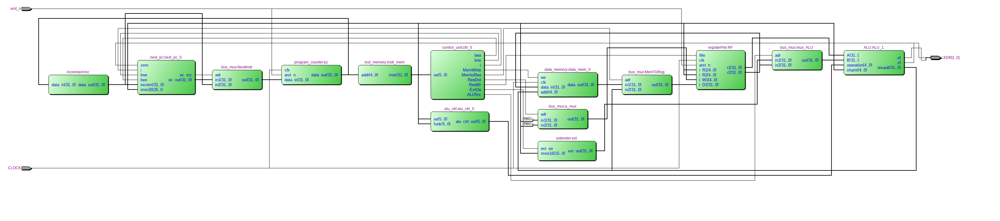
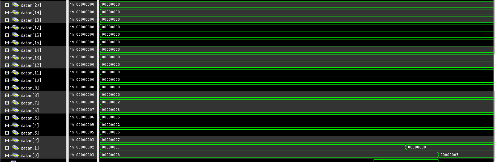
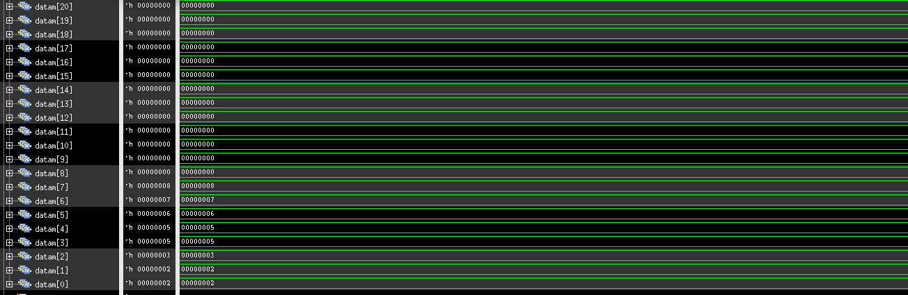
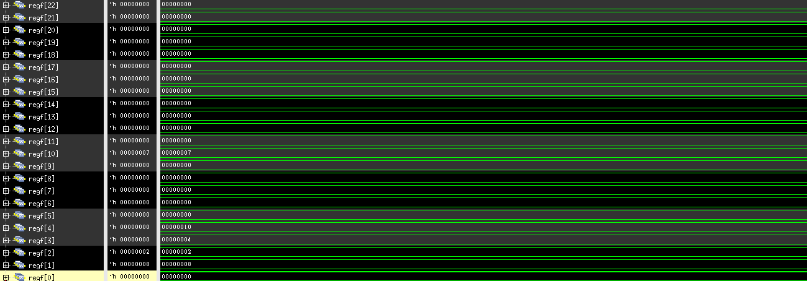

=============================================
Лабораторна робота №5 та №6
=============================================

Тема
----------

Створення MIPS подібного ядра.

Хід роботи
----------

**Специфікація.** 

Специфікація була визначена явно у завданні.
* Зібрати однотактне MIPS подібне ядро, що підтримує інструкції:
add, sub,
slt, mulhigh, mullow, div,
and, or, nor, xor,
lsl, lsr, asr, ror, 
beq, bne, jump,
lw, sw``,

* написати на асемблері програму та перетворити його на текстовий файл з двійковими інструкціями

**Створення проекту.** 

Данний проект було створено на мові Verilog , частини коду були взяті у Харчука Вадима та Єсича Дмитра. Такі модулі як  АЛУ та регістровий вайл 
були взяті з попередніх лабораторних робот з допрацюваннями. Для данної роботи було написано програму в машинному коді,
 а її опис асемблера було закоментовано у машинному коді.  

**Опис виконаної роботи** 

Всі інструкції які повинні виконуватись ядром виконуються. Основна відмінність 
створеного MIPS від оригінального MIPS - це інший program counter, а саме кратність на 4 було вилучено.
 В модулі регістрового файлу було створено нульовий регістр в якому завжди зберігається нуль. В модуль АЛП було додоно окремий вхід даних
для кількості здвигів ,а також в АЛП було реалізовано інструкцію "slt". 
Інші модулі мули створенні з самого початку. Після створення самого ядра було написано програму для перевірки працездатності  процесора , прогама виконує сортування масиву довільного 
розміру за алгоритмом "бульбашка", а також ділить та множить мвксимальне значення в масиві на мінімальне.Instruction i data memory були реалізовані за допомогою функції readmemh. Це дає нам деяке прискорення введеня данних нашого масиву. За допомогою Quest Timing Analysis визначили максимальну частоту для свого ядра - 2.85МГц. 
Zero i Overflow виведені на світлодіоди LEDR[1:0]. 

Так виглядає RTL схема MIPS

Mаксимальна частота 

Вигляд масиву данних для сортування в регістрі data memory

Результат сортуваннямасиву данних

Кінцеві значення регістру, перевірка виконання множення та ділення

Висновки
-----------

Під час виконання лабораторної роботи я створив MIPS подібне ядро яке працює відплвідно до поставленого завдання. Робота була виконана на основі роботи Єсича Дмитра. Також
протокол до данної роботи виконаний на основі протоколу Єсича та Харчука.
Також було написано алгоритм сортування бульбашкою на асемблері та в ручну переведено в машинний код. 
Однотактний процесор готовий до завантаження у плату. 
Дізнався багато нових "фіч" з MIPS а отримав багато нових знань по мові Verolog

