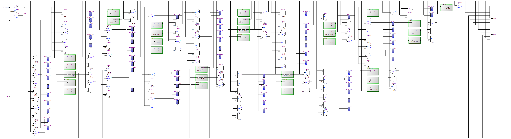
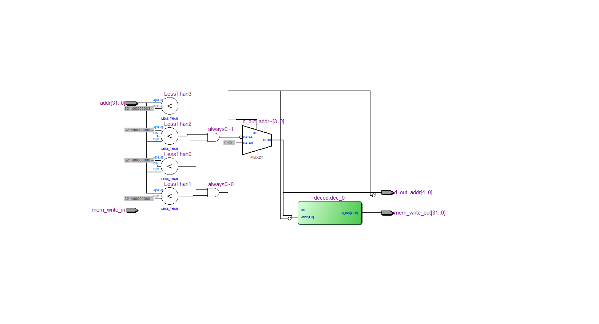

=============================================
Лабораторна робота №7
=============================================

Тема
------

Додавання memory mapped peripherals до ядра (GPIO)

Хід роботи
-------

**Специфікація** 
	Модуль GPIO містить в собі 32 порти вводу-виводу. Робота з ними проводиться за допомогою регістрів DDR(режим входу чи виходу), PORT(подання сигналу на вихід),
та PIN(читання сигналу з виходу).

**Створення проекту** 
	Проект створено на мові Verilog, це дозволило зменшити затрати в часі на створення проекту. Кожен блок, як і в попередніх лабораторних роботах було створенно окремо, це дозволило пришвидшити 
	відладку плати. Було написано тестовий файл на мові Verilog, що допомогло відладити пристрій.

**Опис виконаної роботи** 
	Реалізація 32-хбітного модуля GPIO взято в Олександра Шліхти. Маємо дозволений діапазон для GPIO від 128 до 130([128..130]).Додано модуль Дата контроль,
 який дав нам змогу легше додавати нові модулі у вільний простір нашої пам"яті.
Цей контроль данних з"єднує сигнали write enable до потрібного модуля, а також вказує з якого модуля будуть подаватись данні на "вихід" простору пам'яті.
Програмний ШІМ був реалізований на асемблері, який був взятий у пана Шліхти. У тестбенчі показано,як змінюється
ширина імпульсів, в залежності від поданого на вхід коду.

RTL схема GPIO модуля

RTL схема модуля Data control

Висновки
-------

В даній лабораторній роботі, було вивчено принцип роботи модуля GPIO. Також було створено програму що реалізує дешифратор семисигментного індикатора та ШІМ-контроллер.
На практиці роботу модуля не було протестовано, тому що за нестачею часу не змогли цього зробити. Але було все протестовано у симуляції, все працює коректно
та не викликає питань. Данний проект був створений на основі роботи Пана Шліхти Олександра.

