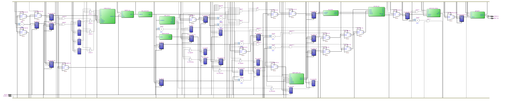
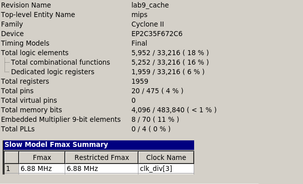

=============================================
Лабораторна робота №9
=============================================

Тема
----------

Додавання кеш-пам'яті до конвеєрного RISC ядра.

Хід роботи
----------

**Завдання.**
Завданням данної лабораторної роботи було свторити Кеш, для передачі данних між пам'яттю данних та процесором.

**Створення проекту.** 
Проект було вирішено реалізувати на HDL SystemVerilog, як більш функціональному наступнику Verilog. 
Було використано модулі з попередніх лабораторних робіт, для повної роботоздатності ядра.
Все було з'єднано та протестовано у симуляторах. 

**Що зроблено.**
Усі вимоги, зазначені у специфікації, було виконано. Пам'ять даних було вирішено зробити з 128-бітною шиною даних
для виконання транзакцій в кеш за один такт. Кеш 4-слівний, 2 лінії на модуль, 4-асоціативний, слово 32 біти. 
політика витіснення LRU, працює за 1 такт при попаданні
та 2 такти при промаху. 
На своєму асемблері переписав програму сортування з 6 лаби та перевірив в Incisive, що все працює як треба.

RTL схема mips

Ресурси використані у цьому ядрі.

Висновки
-----------

Данна лабораторна робота та протокол була виконана на основі лабораторної роботи Матюши "Rabu" Олега. Було ствоернно та приєднано Кеш до конвеєрного Міпса,
використано попередні модулі з лабораторних робіт. Кеш зберігає у собі данні з основної пам'яті. Такий Кеш-контролер використовується для усіх типів пам'яті, які
підключаються як зовнішня периферія. Assembler was taken from Oleh too.

